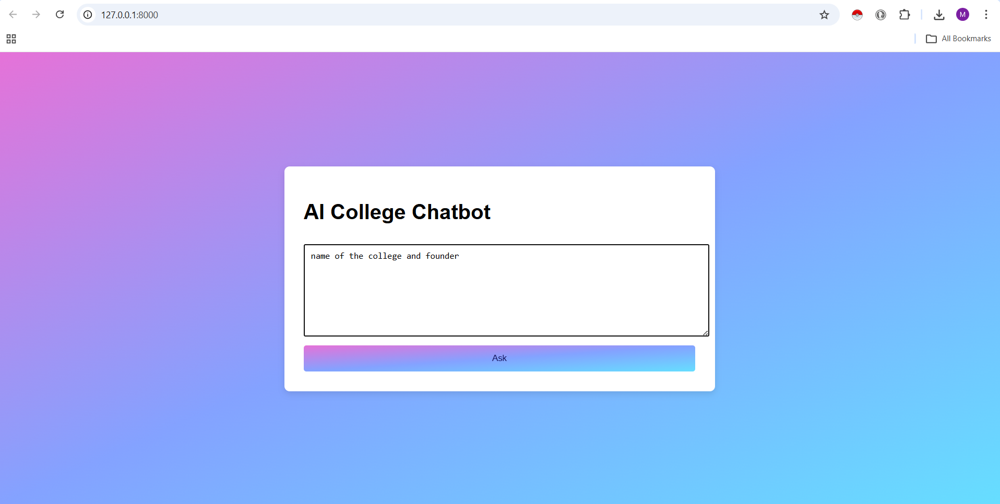
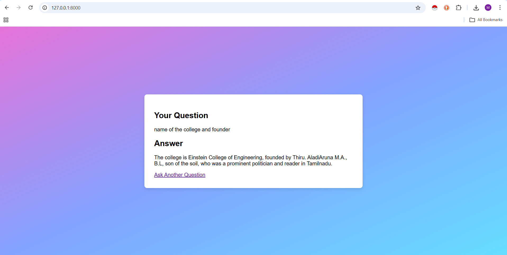

# AI College Chatbot

AI College Chatbot is a web-based chatbot application that helps users get information about a college automatically.  
The chatbot uses web scraping to collect information and provides answers through a simple chatbot interface.

## Features

- Chatbot interface for asking college-related questions
- Automatic information retrieval using web scraping
- Fast and simple user interface
- Built using Django framework
- Easy to extend with more AI features

## Technologies Used

- Python
- Django
- HTML
- CSS
- Web Scraping (BeautifulSoup / Requests)

## Project Structure

ai_college_chatbot/
│
├── chatbot/              # Main chatbot application
├── templates/            # HTML templates
├── static/               # CSS and static files
├── manage.py             # Django project manager
├── requirements.txt      # Project dependencies
└── README.md             # Project documentation

## Installation and Setup

Follow these steps to run the project locally.

### 1. Clone the Repository

git clone https://github.com/Mursaleen67/ai_college_chatbot.git

### 2. Navigate to the Project Folder

cd ai-college-chatbot

### 3. Install Required Libraries

pip install -r requirements.txt

### 4. Run the Django Development Server

python manage.py runserver

### 5. Open the Application

Open your browser and go to:

http://127.0.0.1:8000

## Screenshots

### Chatbot Interface

### Result Page

## Future Improvements

- Add advanced AI response generation
- Improve chatbot UI
- Add database for storing chat history
- Deploy the chatbot online

## Author

Developed as a Django AI project for learning and practice.